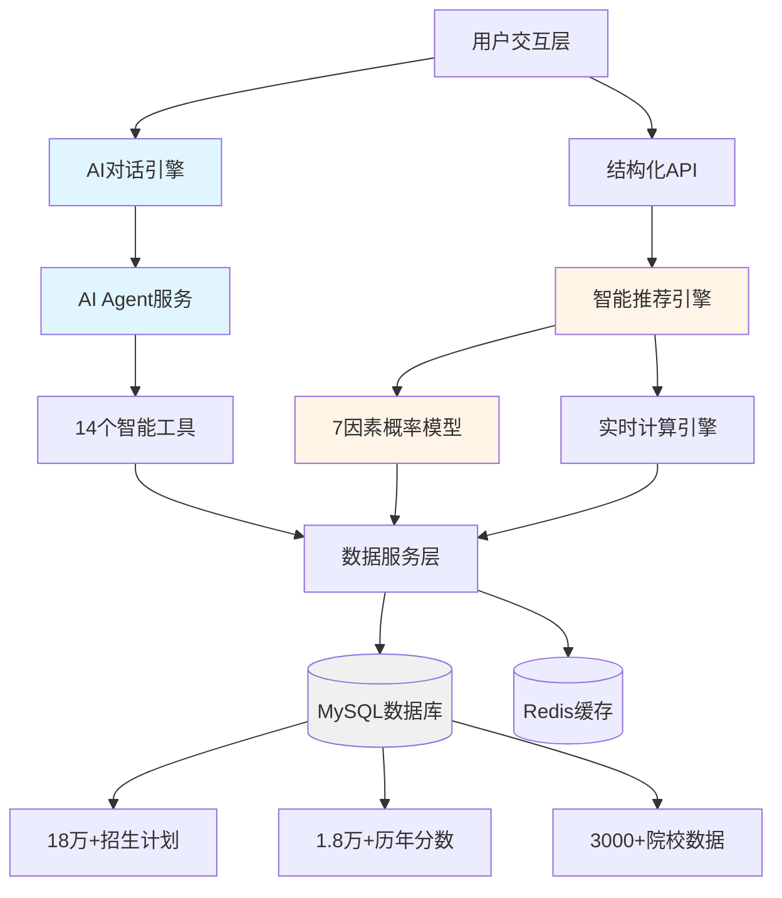
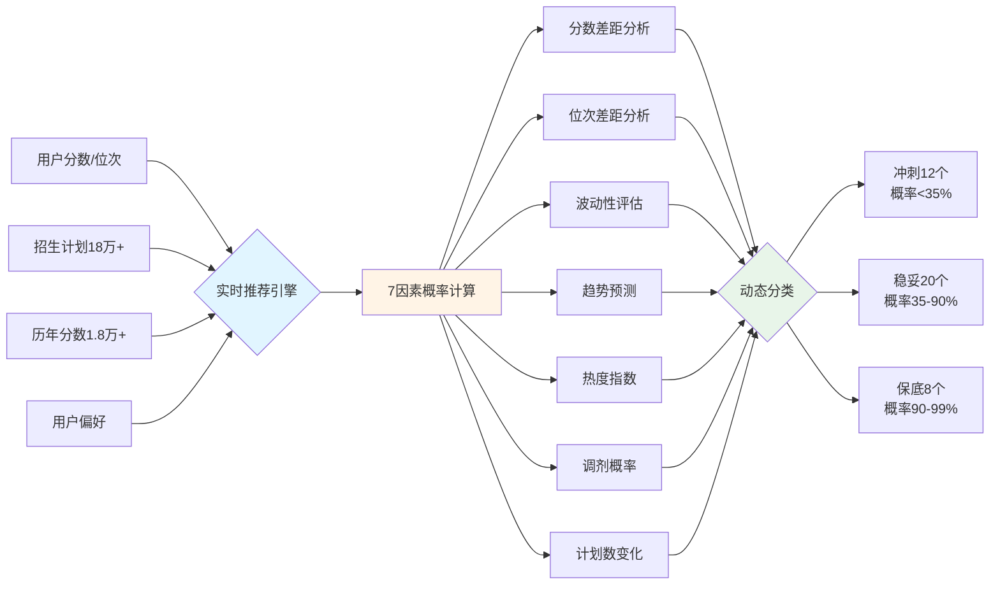
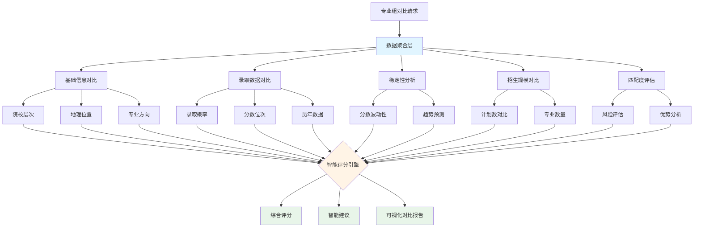
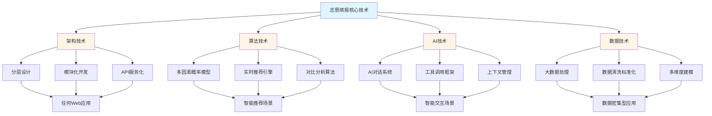
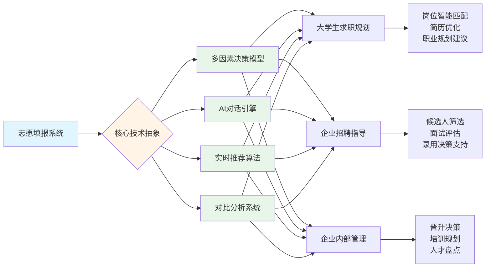

# 商业策划书 - 第三部分 技术分析

## 3.1 技术创新

### 3.1.1 总体技术创新概述

志愿填报智能推荐系统是一个基于人工智能和大数据技术的创新型教育决策支持平台。本系统突破了传统志愿填报工具"静态查询"和"经验主导"的局限，创造性地将大语言模型（LLM）、实时推荐算法、多因素决策模型和智能对话系统深度融合，形成了一套完整的智能化决策支持技术体系。

系统采用现代化的技术栈，后端基于Node.js + TypeScript + Express构建高性能API服务，前端支持React/Vue等主流框架，数据层采用MySQL存储18万+招生计划和1.8万+历年录取数据，并通过Redis实现高效缓存。整体架构遵循分层设计原则，表现层、业务层、数据层职责清晰，确保系统的可维护性和可扩展性。



### 3.1.2 核心技术创新点

#### 创新点一：AI驱动的对话式决策系统

传统志愿填报系统采用表单填写和条件筛选的方式，用户需要明确知道各项参数含义，学习成本高且交互体验僵化。本系统创新性地引入基于大语言模型的对话式交互，考生可以用自然语言表达需求，系统通过意图识别和上下文理解，自动调用后端专业工具完成复杂查询和推荐任务。

系统实现了完整的AI Agent架构，包含14个专业化工具（智能推荐、院校匹配、专业筛选、位次查询、录取概率计算等），每个工具负责特定的业务功能。AI Agent通过工具调用机制（Tool Calling）将自然语言指令转化为结构化的数据查询和计算任务，实现了"理解-推理-执行-反馈"的完整闭环。同时，系统支持多轮对话上下文管理，能够记忆用户的历史偏好和对话历史，提供连续性的决策支持。

这种创新将用户的操作复杂度从"多步骤表单填写+手动筛选"降低为"一句话表达需求"，大幅提升了用户体验和决策效率。

#### 创新点二：实时动态推荐算法

传统志愿推荐系统通常采用预先计算并存储"冲稳保"分类的方式，这种方法存在两个致命缺陷：一是同一专业组对所有分数段的考生都是固定分类，缺乏个性化；二是历史数据更新后需要全量重新计算，维护成本高。

本系统创新性地采用实时动态计算模式，每次推荐请求都根据用户的实际分数、位次和偏好，即时计算录取概率并生成个性化的冲稳保分类。这意味着同一个专业组，对于600分的考生可能是"冲"，但对620分的考生则可能是"稳"，真正实现了"千人千面"的个性化推荐。

系统设计了三级推荐策略：**冲刺级**（录取概率<35%，推荐12个）、**稳妥级**（录取概率35%-90%，推荐20个）、**保底级**（录取概率90%-99%，推荐8个），确保志愿表梯度合理。所有计算都基于真实的历史数据实时完成，无需预存结果，既提升了推荐准确性，又降低了系统维护成本。



#### 创新点三：多因素录取概率计算模型

现有志愿填报系统多采用简单的分数对比或线性回归模型，预测准确率有限。本系统创新性地构建了**7因素综合概率模型**，从分数、位次、稳定性、趋势、招生计划等多个维度全面评估录取可能性。

模型的7个核心因素包括：
1. **分数差距**：用户分数与专业组历年平均最低分的差距
2. **位次差距**：用户位次与专业组历年平均最低位次的差距
3. **分数波动性**：通过标准差衡量历年录取分数的稳定性
4. **分数趋势**：分析录取分数线的上升或下降趋势
5. **调剂概率**：基于招生计划数和专业数量的调剂风险
6. **热度指数**：专业的报考热度对录取难度的影响
7. **计划数变化**：招生计划的增减对录取概率的影响

每个因素都有独立的计算逻辑和权重配置，最终通过加权融合得出综合录取概率。这种多维度建模方式显著提升了预测的科学性和准确性，为考生提供更可靠的决策依据。

#### 创新点四：智能推荐卡片自动格式化技术

传统AI对话系统返回的推荐结果通常是纯文本或Markdown格式，前端需要复杂的解析逻辑才能渲染为交互式组件。本系统创新性地实现了**推荐卡片自动格式化技术**，AI在生成推荐结果时自动检测数据类型，将推荐数据封装为前端友好的结构化JSON格式，并通过特定的Markdown代码块标记（` ```recommendation-card`）传递给前端。

前端通过检测这个特殊标记，直接提取JSON数据并渲染为交互式的推荐卡片组件，无需额外的数据转换和解析逻辑。每张推荐卡片包含院校信息、专业组详情、录取概率、历年数据、风险评估等完整信息，用户可以直接进行详情查看、对比分析、一键添加等操作。

这种创新实现了"AI生成→前端渲染"的无缝衔接，既保持了对话的自然性，又提供了丰富的交互功能，是AI对话系统与前端组件化设计的完美结合。

#### 创新点五：多维度专业组对比分析系统

为了帮助考生在多个志愿选项中做出最优决策，系统创新性地设计了**20+维度的专业组对比分析功能**。对比维度覆盖基本信息（院校、专业、地域）、录取数据（概率、位次、分数）、历年稳定性（波动性、趋势）、招生规模（计划数、专业数）、用户匹配度（风险评估）等多个层面。

系统不仅提供数据的并列对比，还通过智能算法生成**综合评分和差异化建议**。例如，当两个专业组录取概率相近但分数波动性差异较大时，系统会自动提示"A专业组分数更稳定，风险较低，建议优先选择"。这种智能化的决策支持帮助考生快速理解复杂数据，做出明智选择。



### 3.1.3 技术架构创新

系统采用**分层模块化架构**，将AI能力、推荐算法、数据服务解耦为独立模块，确保各模块可以独立开发、测试和升级。AI层使用工具化设计，14个专业工具各司其职，支持灵活组合和扩展。业务层实现了25+个专业服务，覆盖推荐、查询、对比、管理等全流程功能。数据层基于TypeORM实现强类型保证，所有数据模型都有完整的类型定义，大幅降低了运行时错误。

系统支持**双模式响应**：普通模式适用于快速查询场景，流式模式（SSE）适用于复杂推理场景，用户可以实时看到AI的思考过程。这种设计既保证了响应速度，又提升了用户的信任感和参与感。

在性能优化方面，系统采用**多级缓存策略**（Redis缓存热门数据）、**数据库索引优化**（复合索引加速查询）、**智能分页**等技术，确保在百万级数据规模下仍能实现毫秒级响应。安全方面采用JWT认证、密码加密、请求验证、CORS跨域保护等多重防护机制，保障用户数据安全。

### 3.1.4 数据驱动的创新

系统构建了**完整的数据闭环**：从Excel数据导入、数据清洗标准化、数据库存储优化、实时查询计算，到结构化输出和Excel导出，形成了一套高效的数据流转体系。系统预加载了18万+条2025年招生计划、1.8万+条2021-2024年历年录取分数、3000+所院校的详细信息，为智能推荐提供了坚实的数据基础。

所有推荐结果都**有据可依、可追溯**。用户可以查看任何一个推荐结果的计算依据，包括历年最低分、最低位次、录取人数、专业设置等详细数据，真正做到"让数据说话"，提升了推荐结果的可信度和说服力。

---

## 3.2 技术的可转移性

### 3.2.1 技术可转移性总体分析

志愿填报智能推荐系统所采用的核心技术具有高度的通用性和可转移性。系统的技术架构本质上是一个**"多因素决策支持平台"**，其核心能力包括：大数据分析、智能推荐算法、AI对话交互、多维度对比分析、概率预测模型等。这些技术能力可以广泛应用于教育、职业、医疗、金融等多个需要智能决策支持的领域。

技术可转移性体现在三个层面：**架构层面**（分层设计、模块化、工具化）可以复用到任何Web应用；**算法层面**（多因素概率模型、实时推荐引擎）可以迁移到任何推荐场景；**AI层面**（对话系统、工具调用、上下文管理）可以应用到任何需要智能交互的领域。



### 3.2.2 核心应用场景的技术转移

#### 应用场景一：大学生求职规划智能系统

大学生就业是一个涉及多重因素的复杂决策过程，需要综合考虑个人能力、专业背景、职业兴趣、行业前景、薪资待遇、地域选择等多个维度。志愿填报系统的核心技术可以完整迁移到求职规划场景，为大学生提供全流程的智能求职决策支持。

**数据层转移**：将院校专业数据替换为企业岗位数据库。数据结构包括企业信息（规模、行业、地点、发展阶段）、岗位要求（专业、技能、经验、学历）、薪资待遇（薪资区间、福利、晋升路径）、历年招聘数据（录用率、竞争比例、面试难度）等，与本系统的数据模型高度契合。

**算法层转移**：7因素概率模型可以改造为求职匹配度评估模型，核心评估维度包括：
1. **能力匹配度**：求职者的专业背景、技能水平与岗位要求的匹配程度
2. **竞争力评估**：基于GPA、实习经历、项目经验、证书等的综合竞争力
3. **录用概率预测**：根据历年录用数据和竞争比例，预测获得offer的可能性
4. **薪资达标率**：求职者期望薪资与岗位薪资区间的匹配度
5. **地域偏好**：工作地点与求职者地域偏好的匹配程度
6. **行业前景**：目标行业的发展趋势和职业成长空间
7. **企业稳定性**：企业的经营状况、融资情况、人员流动率等

系统可以为每个求职者生成个性化的岗位推荐列表，分为"冲刺岗位"（能力略低但值得尝试）、"匹配岗位"（能力相符录用概率高）、"保底岗位"（能力超出稳妥保底）三个层级，帮助求职者合理分配投递精力，提高求职成功率。

**AI层转移**：AI对话系统可以扩展为智能求职助手，包含以下专业工具：
- **岗位智能匹配工具**：根据专业、技能、期望自动推荐合适岗位
- **简历优化工具**：分析岗位要求，提供针对性的简历修改建议
- **面试准备工具**：提供目标企业和岗位的面试题库、面试技巧
- **薪资谈判工具**：基于行业数据和个人背景，提供合理的薪资期望建议
- **职业规划工具**：分析不同职业路径的发展前景和技能要求
- **求职进度管理**：追踪投递状态、面试安排，提供时间管理建议

求职者可以通过自然语言与系统对话，例如"我是计算机专业应届生，擅长Java和Python，想在北京找月薪12K以上的后端开发工作"，系统自动分析需求，调用匹配工具推荐合适岗位，并提供简历优化和面试准备建议。对于"这两个岗位哪个更适合我"的提问，系统可以调用对比分析工具，从薪资、发展空间、工作强度、企业文化等多个维度进行对比，给出个性化建议。

**技术迁移成本**：约30-35%的工作量，主要包括数据接入（对接招聘网站API或爬取数据）、算法参数调整（匹配度计算逻辑）、AI工具开发（求职领域专业工具）。核心架构和推荐引擎无需重构，开发周期约2-3个月。

#### 应用场景二：企业招聘智能决策系统

企业招聘同样是一个多因素决策问题，HR需要从大量简历中筛选合适的候选人，评估候选人与岗位的匹配度，预测候选人的入职概率和留存率。志愿填报系统的技术可以为企业提供智能化的招聘决策支持。

**数据层转移**：将考生数据替换为候选人数据库。数据结构包括候选人基本信息（教育背景、工作经历、项目经验）、技能评估（专业技能、软技能、语言能力）、求职偏好（期望薪资、工作地点、职业方向）、历史招聘数据（各岗位的简历数量、面试通过率、offer接受率）等。

**算法层转移**：多因素概率模型可以转化为候选人评估模型，核心评估维度包括：
1. **能力评估**：候选人的专业能力、技能水平与岗位要求的匹配度
2. **经验匹配**：工作年限、行业经验、项目经验的相关性
3. **稳定性预测**：基于候选人跳槽频率、职业规划预测留存率
4. **薪资期望匹配**：候选人期望薪资与企业预算的匹配程度
5. **文化契合度**：候选人性格特质、价值观与企业文化的契合度
6. **入职概率**：基于候选人求职状态、竞争offer数量预测入职可能性
7. **培养潜力**：评估候选人的学习能力和成长空间

系统可以为每个岗位自动筛选和排序候选人，生成"重点关注"（能力突出值得重点沟通）、"合适人选"（条件匹配可以邀约面试）、"备选名单"（基本符合可作为补充）三个优先级列表，大幅提升HR的筛选效率。

**AI层转移**：AI对话系统可以扩展为企业招聘助手，包含以下功能：
- **简历智能筛选**：自动分析简历，提取关键信息，评估匹配度
- **候选人对比分析**：多维度对比多个候选人，生成对比报告
- **面试问题生成**：根据岗位要求和候选人背景，生成个性化面试题
- **录用决策支持**：综合多轮面试评价，提供录用建议和薪资方案
- **人才库管理**：维护企业人才库，为新岗位快速匹配历史候选人
- **招聘数据分析**：分析招聘漏斗各环节数据，优化招聘流程

HR可以通过对话询问"筛选出3年以上Java开发经验、熟悉微服务架构、能接受15-20K薪资的候选人"，系统自动执行筛选并返回排序后的候选人列表。对于"对比这三位候选人的技术能力"的提问，系统调用对比工具从技能广度、项目深度、学习能力等维度生成对比分析报告。

**对比分析功能**：复用20+维度对比系统，对比不同候选人的教育背景、工作经验、技能水平、薪资期望、稳定性指标、面试表现等，并生成智能建议，如"候选人A技术能力最强但薪资期望较高，候选人B综合素质均衡且稳定性好，建议优先考虑"。

**技术迁移成本**：约35-40%的工作量，主要包括简历解析技术集成、候选人评估模型开发、面试管理功能开发。开发周期约3-4个月。

#### 应用场景三：企业内部人才管理与发展系统

企业内部人才管理涉及员工绩效评估、晋升决策、培训规划、岗位调配等多个环节，需要综合考虑员工能力、绩效表现、发展潜力、岗位匹配度等因素。志愿填报系统的技术可以为企业构建智能化的人才管理平台。

**数据层转移**：将学生-专业-院校数据替换为员工-岗位-部门数据。数据结构包括员工档案（基本信息、教育背景、工作经历）、绩效数据（历年绩效评级、KPI完成情况、360度评价）、能力评估（专业技能、管理能力、创新能力）、岗位需求（岗位职责、能力要求、晋升路径）、组织架构（部门设置、岗位编制、人员配置）等。

**算法层转移**：多因素决策模型可以转化为员工发展评估模型，应用于多个场景：

**场景1：内部晋升决策**
- **绩效表现**：历年绩效评级的趋势和稳定性
- **能力评估**：目标岗位所需能力与员工现有能力的匹配度
- **发展潜力**：学习能力、创新能力、领导力的综合评估
- **经验适配**：工作年限、项目经验与晋升要求的匹配度
- **团队评价**：同事和下属的360度评价反馈
- **稳定性考量**：员工离职风险和忠诚度评估
- **晋升准备度**：培训完成情况、资格认证、技能储备

系统可以为每个晋升岗位自动筛选和排序候选员工，生成"强推荐"（能力突出晋升准备充分）、"可考虑"（基本符合需要进一步培养）、"暂不合适"（能力差距较大需要更多时间）三个层级，为HR和管理层提供数据驱动的晋升决策支持。

**场景2：培训需求分析与规划**
- **能力差距分析**：对比员工现有能力与岗位要求，识别能力短板
- **职业发展路径**：基于员工职业规划，推荐合适的培训课程
- **培训优先级**：根据岗位重要性、能力差距、紧迫性排序培训需求
- **培训效果预测**：基于历史数据，预测培训投资回报率

**场景3：岗位调配与人才盘点**
- **岗位匹配度**：评估员工与当前岗位的匹配程度，识别错配风险
- **内部流动推荐**：为发展受限或岗位不适配的员工推荐内部转岗机会
- **继任者规划**：为关键岗位提前储备和培养后备人才
- **组织优化建议**：基于人员能力和岗位需求，提供组织架构优化建议

**AI层转移**：AI对话系统可以扩展为企业人才管理助手，包含以下功能：
- **员工发展规划工具**：为员工规划职业发展路径，推荐培训和项目机会
- **晋升候选人推荐**：根据岗位要求自动推荐合适的内部候选人
- **绩效分析工具**：分析员工绩效趋势，识别高潜员工和绩效风险
- **能力差距评估**：对比员工能力与目标岗位要求，生成培训建议
- **人才对比分析**：多维度对比多个候选人，支持晋升和调配决策
- **组织健康诊断**：分析部门人才结构、能力分布、流失风险

HR或管理者可以通过对话询问"推荐产品经理岗位的晋升候选人"，系统自动分析所有符合条件的员工，评估能力匹配度、绩效表现、发展潜力等，生成排序推荐列表。对于"对比张三和李四谁更适合晋升为技术总监"的提问，系统调用对比工具从技术能力、管理经验、团队评价、领导力、稳定性等维度生成详细的对比分析报告，并提供决策建议。

**多维度对比分析**：复用志愿填报系统的20+维度对比功能，对比不同员工的绩效表现、能力评估、发展潜力、团队贡献、创新能力、稳定性指标等，为晋升、调配、培训等决策提供数据支持。系统不仅展示数据对比，还通过智能算法生成差异化建议，如"候选人A技术能力更强，候选人B管理经验更丰富，建议根据岗位侧重点选择"。

**技术迁移成本**：约40-45%的工作量，主要包括员工数据整合、绩效分析模型开发、权限管理和数据安全机制。由于涉及敏感的员工数据和复杂的组织架构，需要更严格的安全设计。开发周期约4-5个月。



### 3.2.3 技术转移的实施路径

**第一阶段：核心技术抽象与封装**（1-2个月）

将志愿填报系统的核心技术抽象为通用的技术组件库，包括：
- 通用推荐引擎框架（支持自定义因素和权重）
- AI对话工具开发框架（支持快速定义新工具）
- 多维度对比分析引擎（支持配置对比维度）
- 数据导入导出工具集（支持Excel、JSON、API等多种格式）

**第二阶段：领域适配与数据接入**（2-3个月）

针对具体的应用场景（如考研、留学、求职），进行领域适配工作：
- 定义领域特定的数据模型（院校→公司，专业→岗位等）
- 设计领域特定的评估因素和权重配置
- 接入领域数据源（API对接、数据爬取、合作方数据等）
- 开发领域特定的AI工具（如"导师查询"、"薪资对比"等）

**第三阶段：业务逻辑定制与优化**（2-3个月）

根据目标场景的业务特点，定制业务逻辑：
- 调整推荐算法的计算逻辑和参数
- 优化AI对话的提示词和交互流程
- 设计场景化的前端界面和用户体验
- 进行A/B测试和算法迭代优化

**第四阶段：上线运营与数据反馈**（持续）

系统上线后，通过用户数据反馈持续优化：
- 收集用户使用数据和反馈意见
- 分析推荐准确率和用户满意度
- 基于真实数据训练和优化算法模型
- 扩展新的功能和应用场景

### 3.2.4 技术转移的商业价值

**降低开发成本**：复用成熟的技术架构和算法模型，新场景的开发成本可降低50%-70%，开发周期可缩短60%以上。

**快速市场验证**：基于验证过的技术方案快速上线MVP产品，缩短市场验证周期，降低试错成本。

**构建技术壁垒**：通过技术的横向扩展，在多个细分领域建立技术优势，形成技术护城河和竞争壁垒。

**实现规模化发展**：一套核心技术支撑多条产品线，实现技术资产的最大化利用和规模化发展，提升公司整体估值。

**培育技术生态**：将核心技术封装为SDK或API服务，向第三方开发者开放，构建技术生态，创造平台化商业价值。

---

**文档版本**：v1.0
**更新日期**：2025-01-31
**编制单位**：志愿填报智能推荐系统项目组
